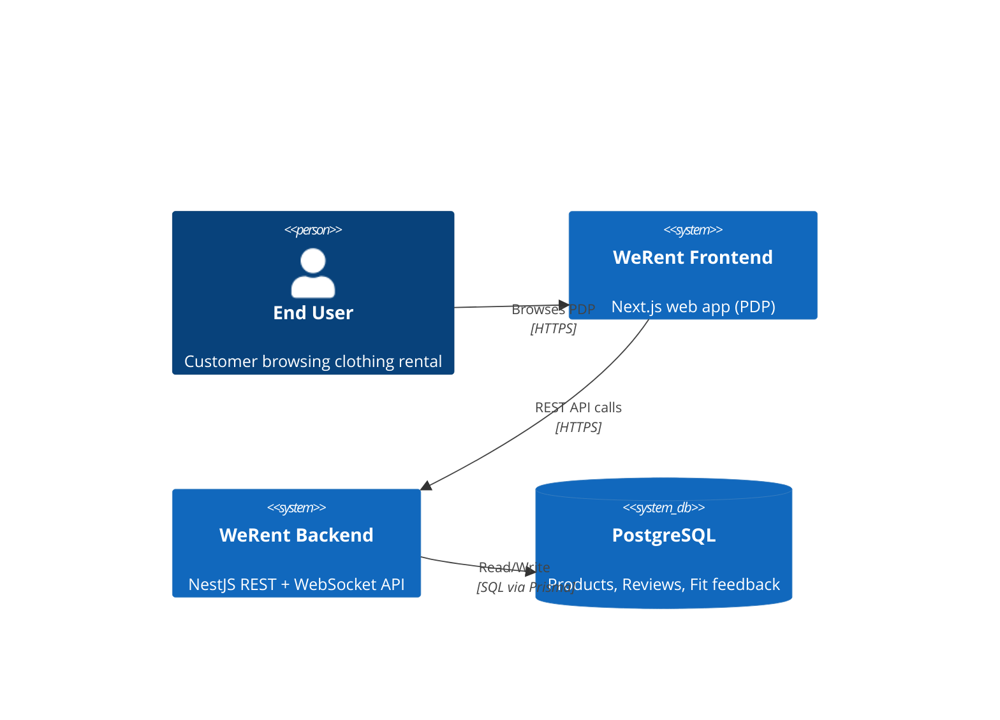
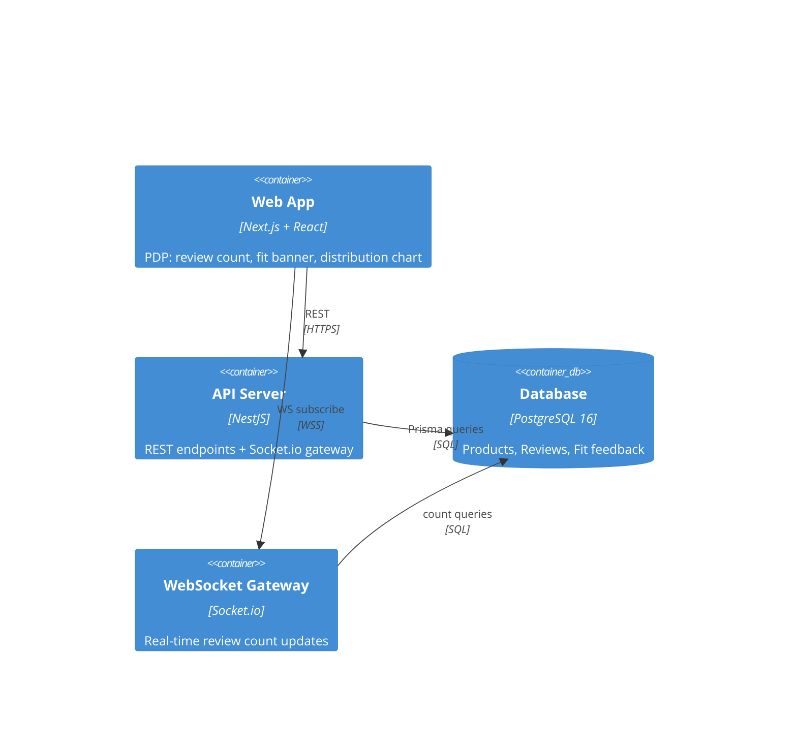
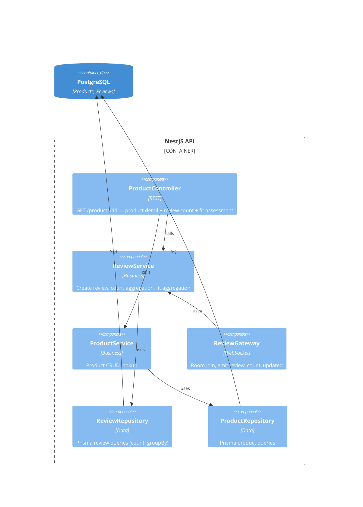

# System Design: WeRent Backend

**Version:** 1.0 | **Date:** 2026-08-16
**Author:** Architect AI

---

## 1. Tech Stack

| Layer | Tech | Version | Rationale | Alternative Considered |
|-------|------|---------|-----------|----------------------|
| Runtime | Node.js | 20 LTS | Matching frontend (Next.js), single language across stack | Go — rejected: overkill for portfolio scope |
| Framework | NestJS | 10.x | Structured modular architecture, built-in DI, WebSocket gateway support | Express — rejected: no structure for growing project |
| Language | TypeScript | 5.x | Type safety, shared types with FE | JS — rejected: no type safety |
| ORM | Prisma | 5.x | Schema-first, typed client, easy migrations | TypeORM — rejected: less DX, slower migrations |
| Database | PostgreSQL | 16 | Relational, ACID, enum support, production-ready | SQLite — rejected: no enum, weaker for prod parity |
| Real-time | Socket.io (via `@nestjs/websockets`) | 4.x | First-class NestJS integration, auto-reconnect, rooms | raw WebSocket — rejected: reinventing reconnection |
| Validation | class-validator + class-transformer | 0.14 / 0.5 | Declarative DTO validation, whitelist enum | manual validation — rejected: error-prone |
| Testing | Jest (unit) + supertest (e2e) | 29.x | NestJS default, zero config | Vitest — rejected: extra config |

### Version Pinning
- Node `^20` (LTS), NestJS `^10.4`, Prisma `^5.22`, Socket.io `^4.7`, PostgreSQL `16` (docker), class-validator `^0.14`, Jest `^29`

---

## 2. System Context (C4 Level 1)



## 3. Container Diagram (C4 Level 2)



---

## 4. Component Diagram (C4 Level 3)



---

## 5. Module Structure (NestJS)

```
src/
├── main.ts                     # Bootstrap: ValidationPipe, CORS, Socket.io adapter
├── app.module.ts               # Root module
├── prisma/
│   ├── prisma.module.ts        # Global PrismaModule
│   └── prisma.service.ts       # PrismaService (extends PrismaClient, onModuleInit)
├── products/
│   ├── products.module.ts
│   ├── products.controller.ts
│   ├── products.service.ts
│   ├── dto/                    # GetProductParams
│   └── repository/
│       └── product.repository.ts
├── reviews/
│   ├── reviews.module.ts
│   ├── reviews.controller.ts   # POST /reviews, GET /reviews/product/:productId
│   ├── reviews.service.ts      # create, count, fit aggregation
│   ├── gateway/
│   │   └── review.gateway.ts   # Socket.io room + emit
│   ├── dto/
│   │   └── create-review.dto.ts
│   └── repository/
│       └── review.repository.ts
├── fit/
│   ├── fit.module.ts
│   ├── fit.service.ts          # pure aggregation algorithm
│   └── fit.types.ts            # FitFeedback enum, FitAssessment interface
└── common/
    ├── enums/                  # FitFeedback enum (mirror Prisma)
    ├── exceptions/             # custom exceptions
    └── interceptors/           # response envelope transformer
```

---

## 6. Data Flow

### 6.1 Product Detail (GET /products/:id)
```
FE → ProductController → ProductService (product) 
                        → ReviewService.count(productId) 
                        → FitService.aggregate(fitFeedbacks)
                        → ProductDetailResponse (product + reviewCount + fitAssessment)
```

### 6.2 Review Created (POST /reviews)
```
FE → ReviewsController → ReviewService.create(dto)
      → txn: create review (with fitFeedback)
      → reviewCount = count(productId)
      → ReviewGateway.emit('review_count_updated', { productId, reviewCount })
      → 201 { review, reviewCount }
```

### 6.3 Socket Subscription
```
FE → socket.emit('joinProductRoom', { productId })
Gateway → socket.join(`product:${productId}`)
[on new review] Gateway → io.to(`product:${productId}`).emit('review_count_updated', payload)
```

---

## 7. Failure Modes & Mitigation

| Failure | Impact | Mitigation |
|---------|--------|------------|
| DB down | 500 on all queries | Retry/backoff on Prisma, health check endpoint, FE shows error state |
| Socket disconnected | Stale count | FE reconnect + refetch count on `connect`; poll fallback |
| Duplicate review submission | Double count | Idempotency: unique constraint `(userId, productId)`; 409 CONFLICT |
| Invalid fit value | Data corruption | Whitelist validation at DTO + Prisma enum constraint (double layer) |
| Transaction fails after review insert | Count/emit mismatch | Emit happens after commit; count recomputed from DB (source of truth) |

---

## 8. Observability

- NestJS default logger (structured JSON in prod)
- Request logging interceptor: method, path, status, duration
- `GET /health` → `{ status: 'ok', db: 'up' }` (Prisma `$queryRaw SELECT 1`)
- Prisma query logging in dev (`LOG: ['query']`)
