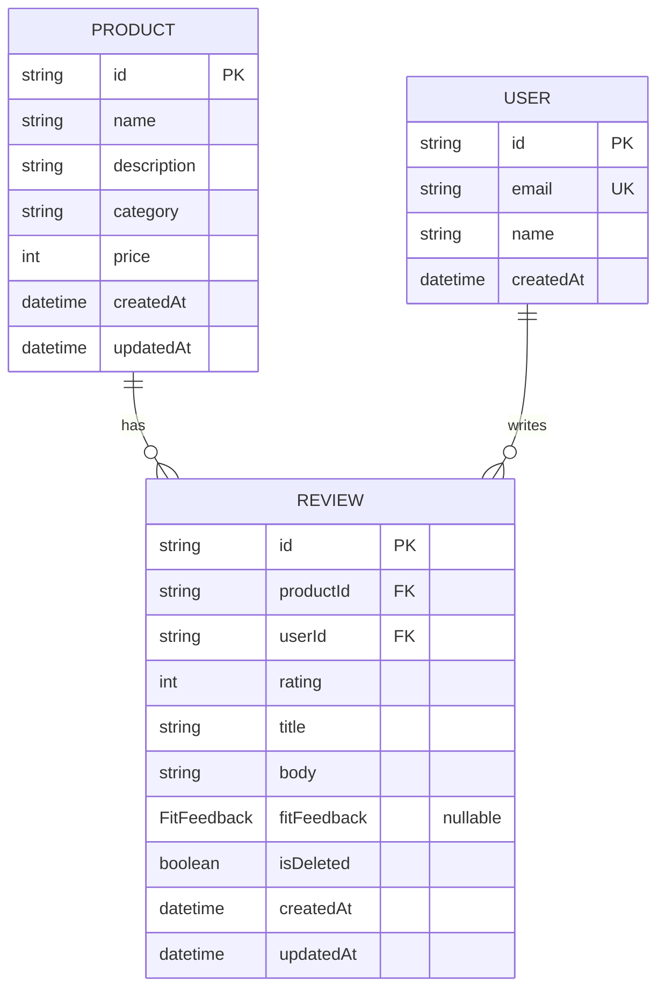

# Database Design: WeRent Backend

**Version:** 1.0 | **Date:** 2026-08-16
**Author:** Architect AI

---

## 1. ER Diagram



---

## 2. Prisma Schema (`prisma/schema.prisma`)

```prisma
generator client {
  provider = "prisma-client-js"
}

datasource db {
  provider = "postgresql"
  url      = env("DATABASE_URL")
}

/// Allowed values for per-reviewer fit feedback.
/// Nullable on Review: reviewer may omit fit feedback.
enum FitFeedback {
  RUNS_SMALL
  TRUE_TO_SIZE
  RUNS_LARGE
}

model User {
  id        String   @id @default(uuid())
  email     String   @unique
  name      String
  createdAt DateTime @default(now())
  updatedAt DateTime @updatedAt

  reviews Review[]

  @@map("users")
}

model Product {
  id          String   @id @default(uuid())
  name        String
  description String
  category    String
  price       Int
  createdAt   DateTime @default(now())
  updatedAt   DateTime @updatedAt

  reviews Review[]

  @@map("products")
}

model Review {
  id         String       @id @default(uuid())
  productId  String
  userId     String
  rating     Int          @db.SmallInt
  title      String
  body       String       @db.Text
  fitFeedback FitFeedback? // nullable: reviewer may skip
  isDeleted  Boolean      @default(false)
  createdAt  DateTime     @default(now())
  updatedAt  DateTime     @updatedAt

  product Product @relation(fields: [productId], references: [id], onDelete: Cascade)
  user    User    @relation(fields: [userId], references: [id], onDelete: Cascade)

  // One review per user per product (idempotency for review count)
  @@unique([userId, productId])
  @@index([productId, isDeleted])
  @@index([productId, fitFeedback])
  @@map("reviews")
}
```

---

## 3. Feature-to-Table Mapping (Issue #14, #9)

| Feature | Tables Used | Critical Queries |
|---------|-------------|------------------|
| F1 Review Count (#9) | `reviews` | `review.count({ where: { productId, isDeleted: false } })` |
| F3 Fit Feedback (#14) | `reviews` (add `fitFeedback` column) | Migration: add nullable enum column |
| F4 Fit Algorithm (#15) | `reviews` | `review.groupBy({ by: ['fitFeedback'], where: { productId } })` |
| F5 Product Detail (#16) | `products`, `reviews` | `product.findUnique` + count + groupBy |

### Migration Strategy (Issue #14)
1. **Baseline migration**: create `users`, `products`, `reviews` (v1)
2. **Add fit feedback**: `ALTER TABLE reviews ADD COLUMN fit_feedback "FitFeedback"` nullable
   - Prisma: edit schema → `npx prisma migrate dev --name add_fit_feedback`
3. Expand-contract: add column nullable → backfill if needed (none, new data) → deploy code → (optional) tighten

---

## 4. Indexes & Constraints

| Index / Constraint | Table | Purpose |
|--------------------|-------|---------|
| `PK` id | all | UUID primary key |
| `@@unique([userId, productId])` | reviews | Idempotency: prevent duplicate review per user-product (double count protection) |
| `@@index([productId, isDeleted])` | reviews | Fast count query with soft-delete filter |
| `@@index([productId, fitFeedback])` | reviews | Fit distribution groupBy acceleration |
| `UNIQUE email` | users | User identity |
| rating 1–5 validation | reviews (DTO only) | Enforced at application layer (`@Min(1) @Max(5)`); no DB `CHECK` constraint yet — see §6 note |
| FK cascade delete | reviews→product, reviews→user | Cleanup |

---

## 5. Design Decisions & Trade-offs

| Decision | Choice | Why NOT the alternative |
|----------|--------|--------------------------|
| Soft delete on review | `isDeleted` boolean | Why NOT hard delete: auditability, count aggregation can filter; simpler than deletedAt |
| Fit feedback on Review table | nullable enum column | Why NOT separate `FitFeedback` table: 1:1 with review, no extra join needed |
| UUID vs serial | UUID (`@default(uuid())`) | Why NOT serial: no enumeration of resources (security), distributed-friendly |
| Enum in DB | Prisma enum | Why NOT varchar + app validation: DB-level constraint = second defense layer |
| Unique user+product | DB constraint | Why NOT app-level check: race-condition safe, guarantees count correctness |
| Int price (IDR) | Int rupiah | Why NOT float: money precision; rupiah has no decimals |

---

## 6. Data Integrity Notes

- `rating` validated 1–5 at the DTO layer only (`@Min(1) @Max(5)`). No DB `CHECK` constraint is defined in the baseline migration — a `CHECK (rating >= 1 AND rating <= 5)` migration is a recommended follow-up for a true second defense layer.
- `fitFeedback` validated against 3 allowed values (DTO whitelist + DB enum)
- Soft-deleted reviews (`isDeleted=true`) excluded from **count** and **fit distribution** (filter `isDeleted: false`)
- Unique `(userId, productId)` makes review count deterministic — no double-count on retry
